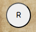

# **Higher or Lower**

This website was created as the 2nd Milestone Project (User Centric Frontend Development) for Code Institute's web application development course.

[**__link to deployed site here__**](https://andrewcannan.github.io/higher-or-lower/)
<br><br>


<br><br>

# Contents

* [User Experience](#user-experience-ux)
    * [Owner Goals](#owners-goals)
    * [Visitor Goals](#visitor-goals)

* [Design](#design)
    * [Wireframes](#wireframes)
    * [Typography](#typography)
    * [Images](#images)
    * [Icons](#icons)
* [Features](#features)
    * [HomePage](#homepage--first-section)
    * [Rules](#rules-section)
    * [Game](#game-section)
        * [Card](#card)
        * [Input and Submission](#user-input-and-submission)
        * [Response](#response)
        * [Timer](#timer)
        * [Next Card](#next-card-button)
        * [Reset and Home](#reset-and-home-buttons)
    * [Footer](#footer)
    * [404 Page](#404-page)
    * [Future Implementations](#future-implementations)
* [Technologies](#technologies)
    * [Languages](#languages)
    * [Frameworks/Libaries/Programs](#frameworks-libaries-and-programs)
* [Testing](#testing)
    * [HTML Validation](#html-validation)
    * [CSS Validation](#css-validation)
    * [Accessibility](#accessibility)
    * [Performance](#performance)
* [Deployment](#deployment)
* [Credits](#credits)
<br><br>


# User Experience

Higher or Lower is a simple card guessing game where you have three attempts in 99 seconds to correctly guess the value of the face down card.
<br><br>

## Owners Goals

To provide a basic fun game for the user to play.

## Visitor Goals

Play a Game?
<br><br>


# Design

## WireFrames 

Wireframes created on [Figma](https://www.figma.com/).

<details>
<summary>Homepage Desktop</summary>
<br>

</details>
<details>
<summary>Homepage Mobile</summary>
<br>

</details>
<details>
<summary>Rules Desktop</summary>
<br>

</details>
<details>
<summary>Rules Mobile</summary>
<br>

</details>
<details>
<summary>Game Desktop</summary>

</details>
<details>
<summary>Game Mobile</summary>
<br>

</details>
<br><br>

## Typography 

For the main headings a western style font was chosen *insert link* to stay it the overall theme off the game. For all other text Roboto *insert link* was chosen as its modern and easily readable. All fonts from Google Fonts.
<br><br>

## Images 

*fill in later*
[CloudConvert](assets/images/vintage-grunge-paper-background.webp) was used to convert the background image into webp for faster loading.
<br><br>

## Icons

Icons used for the Reset and Home buttons and in the Footer are from [FontAwesome](https://fontawesome.com/).

Logo image was used to create a favicon at [Favicon.io](https://favicon.io/).
<br><br>

# Features

A single page application that has three main sections that hide/show on the relevant button clicks.

## Homepage / First Section

On intial load of the site this is the header div that is only shown whilst the other two main divs are hidden on page load. Consists of a logo and the game heading, also a button that will toggle the display attribute of this div and show only the rules div.
<details>
<summary>Homepage</summary>

</details>
<br><br>

## Rules Section

This section explains the rules of the game to the user for the upcoming game. consists of heading and rules text, also a button that will toggle the display attribute of this div to hidden and show the game div.
<details>
<summary>Rules</summary>

</details>
<br><br>

## Game Section

This is the main part of the application and has a few main parts to it. The heading, the card, the users input and submission, a timer, a next card button, the response to the user (i.e scores and hints) and two buttons.

### Card 

The card is displayed face down initially the "card back" always displays the same image but the "card face" is assigned randomly, it is two divs positioned absolutely on top of each other wrapped in a container that will flip to reveal the card face on either a correct guess or when the user has ran out of guesses.
An array stores each card as an object that is picked at random and the corresponding key is assigned to the card face div as a ccs class that has the image for that card.
<details>
<summary>Card Back</summary>

</details>
<details>
<summary>Card Face</summary>

</details>

### User Input and Submission

The input field is set to capatalize the first letter using js to evaluate the users input against the randomly generated answer. 
When submit button is clicked the validate function is called to check the users input is in array of accepted answers, if not the answer will not be submitted and the user alerted. If it is then the answer is accepted and the check answer function called which will evalute the users answer against the randomly picked card. 
<details>
<summary>Input Feild</summary>

</details>
<details>
<summary>Submit Button</summary>

</details>

### Response

This section holds the feeback to the user from the game object that holds the current amount of tries left, correct and incorrect answers. Also a div that show/hides containing a hint to wether the card being guessed is higher or lower than their last guess, if the guess is incorrect. if the timer runs out will also display that to the user, or when ran out of attempts.
<details>
<summary>Game Scores</summary>

</details>
<details>
<summary>Hints</summary>

</details>

### Timer

A while loop that increments the timer in the game object down while the timer is greater than 0. Had a little trouble getting this to increment down once every second and had to learn how to use promise and resolve to achieve this.
<details>
<summary>Timer</summary>

</details>

### Next Card Button

If amount of tries has ran out or the timer has ran out the submit button will hide and the next card button will appear in red. This will call a new game.

If the card is guessed correctly the submit button will hide and this will show in green, will also call a new game when clicked.
<details>
<summary>Next Card Red</summary>

</details>
<details>
<summary>Next Card Green</summary>

</details>

### Reset and Home buttons

A button that will reset the game object, update the scores section and call a new game.

Home button reloads the window and displays the Homepage/First section giving the impression the user has gone back to the start.
<details>
<summary>Reset</summary>

</details>
<details>
<summary>Home</summary>

</details>
<br><br>

## Footer

Footer displays a link to my GitHub profile for more projects to be checked out.
<details>
<summary>Footer</summary>

</details>
<br><br>

## 404 Page

Simple page consisting of Game heading and logo, text to make the user aware theyve reached a broken link and a button to direct them back to the Homepage.
<details>
<summary>404 Page</summary>

</details>
<br><br>

## Future Implementations

If this was to be developed further could create a log in and database to store the users scores and implement a highscore system to intice players to return and beat their score.
<br><br>

# Technologies

## Languages

SIte was created using vanilla HTML and CSS no frameworks, and Javascript with a some Jquery used.

## Frameworks, Libaries and Programs

* JQuery
    * Used to simplify some code written.
* Git / Github
    * Used for version control, storage and deployment.
* Gitpod
    * IDE used.
* GoogleFonts
    * Used for importing fonts into stylesheet.
* Google Dev Tools
    * Used for troubleshooting and small style changes.
* Favicon.io
    * Used to create a favicon.
* Figma
    * Used for to create Wireframes.
* /////
    * Used to source images.
* ////
    * Used to crop cards from main image.
* /////
    * Used to remove background from croped images.
* CloudConvert
    * Used to convert images to webp.
<br><br>

# Testing

## HTML Validation

The [W3C Markup Validation Service](https://validator.w3.org/) was used to validate the HTML code. Passed with 0 errors.
<details>
<summary>HTML Validation</summary>
<br>

</details>
<br><br>

## CSS Validation
The [W3C Markup Validation Service](https://jigsaw.w3.org/css-validator/) was used to validate the CSS code. Passed with 0 errors.
<details>
<summary>Stylesheet</summary>
<br>

</details>
<br><br>

## Accessibility

The [WAVE WebAIM web accessibility evaluation tool](https://wave.webaim.org/) was used to check the site conforms with high accessibility standards. 1 error was shown for an ampty button but thats because the button has a js function that reloads the window. 
<details>
<summary>Accessibility</summary>
<br>

</details>
<br><br>

## Performance
Lighthouse within google developer tools was used to check the overall performance of the site.
<details>
<summary>Lighthouse Report</summary>
<br>

</details>
<br><br>

# Deployment
## Deployment
<br>

The project was deployed to GitHub Pages using the following steps...

1. Log in to GitHub and locate the [GitHub Repository](https://github.com/)
2. At the top of the Repository (not top of page), locate the "Settings" Button on the menu.
3. Scroll down the Settings page until you locate the "Pages" Section.
4. Under "Source", click the dropdown called "None" and select "Main Branch".
5. The page will automatically refresh.
6. Once the deployment process completed the published site's link will appear after the main title.
<br><br>

## Forking the GitHub Repository
<br>

By forking the GitHub Repository we make a copy of the original repository on our GitHub account to view and/or make changes without affecting the original repository by using the following steps...

1. Log in to GitHub and locate the [GitHub Repository](https://github.com/)
2. At the top of the Repository (not top of page) just above the "Settings" Button on the menu, locate the "Fork" Button.
3. You should now have a copy of the original repository in your GitHub account.
<br><br>

## Making a Local Clone
<br>

1. Log in to GitHub and locate the [GitHub Repository](https://github.com/)
2. Under the repository name, click "Clone or download".
3. To clone the repository using HTTPS, under "Clone with HTTPS", copy the link.
4. Open Git Bash
5. Change the current working directory to the location where you want the cloned directory to be made.
6. Type `git clone`, and then paste the URL you copied in Step 3.

```
$ git clone https://github.com/YOUR-USERNAME/YOUR-REPOSITORY
```

7. Press Enter. Your local clone will be created.

```
$ git clone https://github.com/YOUR-USERNAME/YOUR-REPOSITORY
> Cloning into `CI-Clone`...
> remote: Counting objects: 10, done.
> remote: Compressing objects: 100% (8/8), done.
> remove: Total 10 (delta 1), reused 10 (delta 1)
> Unpacking objects: 100% (10/10), done.
```
<br><br>

# Credits

*fill in later*